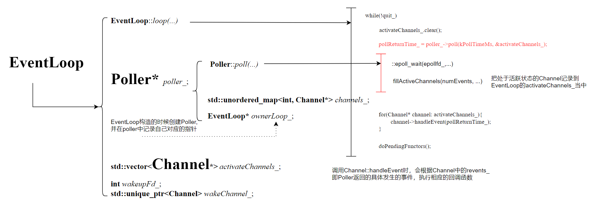

# Muduo网络库各个模块的联系

## 1. EventLoop, Thread, EventLoopThread和EventLoopThreadPool的关系


- ### `wakeup`的作用？

    通常情况下，如果`ioloop`监听的`Channel`有感兴趣的事情发生了，对应的`EventLoop`就会从`poller_->poll()`中的`epoll_wait()`醒来，然后处理处于活跃状态的`Channel`的回调函数。这种情况下不需要`wakeup`来唤醒。

    但实际上，每个`EventLoop`需要处理的回调不仅仅是`Channel`设置的回调，还有其他`EventLoop`派发的需要当前`EventLoop`需要执行的回调。比如说，**mainloop**分配了新的`Channel`给某个**ioloop**，就需要唤醒给**ioloop**并把`Channel`注册到`Poller`中。
    ```cpp
    while(!quit_)
    {
        activateChannels_.clear();
        pollReturnTime_ = poller_->poll(kPollTimeMs, &activateChannels_);
        for(Channel* channel: activateChannels_){   
            channel->handleEvent(pollReturnTime_);  // 执行Channel的回调
        }
        doPendingFunctors(); // 执行额外的需要在该EventLoop执行的回调
    }
    ```
    由于**ioloop**阻塞在了`epoll_wait()`，只有他监听的文件描述符有感兴趣的事件发生了才会醒来，因此**mainloop**给它下发任务，即`EventLoop`之间的派发回调是无法让目标唤醒的。故需要`wakeup`。

    当有新连接到来时，会调用`Acceptor()`绑定`TcpServer`的处理新连接事件的回调函数，在这个回调函数中，会先通过轮询的操作，从`EventLoopThreadPool`记录的`EventLoop`选择一个**ioloop**,之后在**ioloop**所在的线程上执行相应的回调函数，但是此时所在的线程是**mainloop**所在的线程，因此需要把该回调函数放到**ioloop**相应的容器，并通过`wakeup()`将其唤醒（**ioloop**的`Poller`中注册了`wakefd`, 监听了`wakefd`感兴趣的读事件，调用**ioLoop**的`wakeup()`函数，向`wakefd`写入一个数据，这样**ioloop**就会从`epoll_wait()`返回）。**ioloop**被唤醒后就会去处理容器中的回调函数（`doPendingFunctors()`）

    

    **mainloop**交给**ioloop**让他处理的回调函数，包括把`Channel`注册到**ioloop**的`Poller`当中等操作，其中`connectionCallback_()`是用户设置的回调函数，比如可以实现连接的时候打印一些信息，fd: xxx连接到服务器等。

    ```cpp
    void TcpConnection::connectEstablished()
    {
        setState(kConnected);
        channel_->tie(shared_from_this());
        channel_->enableReading();  
        connectionCallback_(shared_from_this()); 
    }
    ```

<br>

## 2. Socket和InetAddress
`Socket`封装了文件描述符`sockfd`。在构造函数中，调用了`::socket()`创建一个套接字，并记录在`sockfd`上。把Tcp网络操作比如`::bind()`， `::listen()`都封装为成员方法。

`InetAddress`封装了ip地址和端口号以及对应处理方法，包括Tcp网络操作中的：
```cpp
memset(&addr_, 0, sizeof(addr_));
addr_.sin_family = AF_INET;
addr_.sin_addr.s_addr = inet_addr(ip.c_str());
addr_.sin_port = htons(port);
```

<br>

## 3. TcpConnection和Acceptor
`TcpConnection`的重要成员变量：
```cpp
EventLoop *loop_;
std::unique_ptr<Socket> socket_;
std::unique_ptr<Channel> channel_;
```
`Acceptor`的重要成员变量：
```cpp
EventLoop* loop_;
Socket acceptSocket_;
Channel acceptChannel_;
```
`Acceptor`是负责处理连接事件的，即**mainloop**中的活，因此他的`loop_`一定是**mainloop**。`TcpConnection`是处理已连接后的读写事件的，他的`loop_`一定不是**mainloop**，除非一共就只有**mainloop**一个`EventLoop`。

`Acceptor`在`TcpServer`构造函数中便创建。它接受了**mainloop**和服务端的ip地址端口号为参数。
`Acceptor()`中的成员变量`Channel`注册到了**mainloop**中的`Poller`，并对读事件(连接)感兴趣，设置了`Channel`处理连接事件的回调函数，其中包含了`::accept()`。当`Poller::poll()`中的`epoll_wait()`检测到`Channel`感兴趣的连接事件发生，就会调用对应的回调函数，回调函数中的`::accept()`返回了给对端创建的文件描述符用于后续处理。


`TcpConnection`在新连接到来时，在`TcpServer::newConnection()`中创建。
`TcpConnection`的`loop_`是该函数中通过轮询从`EventLoopThreadPool`中获取的，如果`EventLoopThreadPool`没有设置初始化线程数量，那么轮询返回的就是**mainloop**，否则就是**subloop**。

其他操作和`Acceptor`类似，本质上就是分开处理不同的任务。


<br>

## 4. Channel, Poller和EventLoop
与其把`Channel`认为是对文件描述符`fd`的封装，倒不如说是对`struct epoll_event`的封装。`struct epoll_event`的结构如下，除了`fd`还有感兴趣的事件`events`
```cpp
typedef union epoll_data                  struct epoll_event
{                                         {
   void *ptr;                                uint32_t events;  /* Epoll events */
   int fd;                                   epoll_data_t data;    /* User data variable */
   uint32_t u32;                          } __EPOLL_PACKED;
   uint64_t u64;
} epoll_data_t;
```
处理io事件时，当某个`Channel`感兴趣的读事件发生(即对应的客户端发来了消息)，`poller_->poll()`就会从`epoll_wait()`中返回，并把处于活跃状态的`Channel`写入到`EventLoop`中的`activateChannels_`当中。

- ### fillActivateChannels的调用
    上面提到的把处于活跃状态的....写入到...的过程使用过调用该函数实现的。`epoll_wait()`函数的使用如下，`epoll_wait`只是把处于活跃状态的`epoll_event`放到了`events_`(`Poller`的一个成员变量)中，这些`events_`中的`ptr`指向的就是处于活跃状态的`Channel`，`events`就是发生的事件。需要做的就是把`events_`记录到`Channel`的`revents_`中，并把`Channel`写入到`activateChannels_`中。
    ```cpp
    ::epoll_wait(epollfd_, &*events_.begin(), static_cast<int>(events_.size()), timeoutMs);

    for(int i = 0; i < numEvents; ++i)
    {
        Channel* channel = static_cast<Channel*>(events_[i].data.ptr);
        int fd = channel->fd();
        ChannelMap::const_iterator it = channels_.find(fd);
        channel->set_revents(events_[i].events);
        activeChannels->push_back(channel);
    }
    ```
处理io事件的逻辑图如下，当`EventLoop`从`poller_->poll()`返回之后，就可以遍历`activateChannels_`并一一根据`revents_`的类型执行`Channel`相应的回调函数。




处理连接事件时，`mainloop`会把需要`ioloop`执行的处理连接事件的回调函数写到`ioloop`的`pendingFunctors_`当中，通过`wakeup`把`ioloop`唤醒后，`ioloop`就会去处理这些回调函数。

- ### doPendingFunctors()的调用

    首先，`mainloop`发现新的连接到来时，就创建一个`TcpConnection`,里面封装了`Channel`等信息，这个`Channel`需要注册到对应`ioloop`的`Poller`当中，怎么注册？`TcpConnection`提供了对应的回调函数`connectEstablished()`，通过调用`Channel`的`enableReading()`方法，根据所在的`EventLoop`间接访问`Poller`的成员方法(包含`epoll_ctl`)。

<br>

## 5. Buffer

初始状态的下的缓冲区如图所示：


读取缓冲区可读区域的数据有两个函数：
```cpp
std::string retrieveAsString(std::size_t len);
std::string retrieveAllAsString();
```


写入缓冲区可能需要扩容

缓冲区扩容，也有两种情况：如果调整缓冲区的结构可以空出一片足够长度的连续空间，就不需要扩容，如果不够再扩容

