# Muduo网络库各个模块的联系

## 1. EventLoop, Thread, EventLoopThread和EventLoopThreadPool的关系
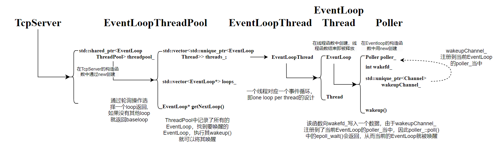

- ### `wakeup`的作用？

    通常情况下，如果`ioloop`监听的`Channel`有感兴趣的事情发生了，对应的`EventLoop`就会从`poller_->poll()`中的`epoll_wait()`醒来，然后处理处于活跃状态的`Channel`的回调函数。这种情况下不需要`wakeup`来唤醒。

    但实际上，每个`EventLoop`需要处理的回调不仅仅是`Channel`设置的回调，还有其他`EventLoop`派发的需要当前`EventLoop`需要执行的回调。比如说，**mainloop**分配了新的`Channel`给某个**ioloop**，就需要唤醒给**ioloop**并把`Channel`注册到`Poller`中。
    ```cpp
    while(!quit_)
    {
        activateChannels_.clear();
        pollReturnTime_ = poller_->poll(kPollTimeMs, &activateChannels_);
        for(Channel* channel: activateChannels_){   
            channel->handleEvent(pollReturnTime_);  // 执行Channel的回调
        }
        doPendingFunctors(); // 执行额外的需要在该EventLoop执行的回调
    }
    ```
    由于**ioloop**阻塞在了`epoll_wait()`，只有他监听的文件描述符有感兴趣的事件发生了才会醒来，因此**mainloop**给它下发任务，即`EventLoop`之间的派发回调是无法让目标唤醒的。故需要`wakeup`。

    当有新连接到来时，会调用`Acceptor()`绑定`TcpServer`的处理新连接事件的回调函数，在这个回调函数中，会先通过轮询的操作，从`EventLoopThreadPool`记录的`EventLoop`选择一个**ioloop**,之后在**ioloop**所在的线程上执行相应的回调函数，但是此时所在的线程是**mainloop**所在的线程，因此需要把该回调函数放到**ioloop**相应的容器，并通过`wakeup()`将其唤醒（**ioloop**的`Poller`中注册了`wakefd`, 监听了`wakefd`感兴趣的读事件，调用**ioLoop**的`wakeup()`函数，向`wakefd`写入一个数据，这样**ioloop**就会从`epoll_wait()`返回）。**ioloop**被唤醒后就会去处理容器中的回调函数（`doPendingFunctors()`）

    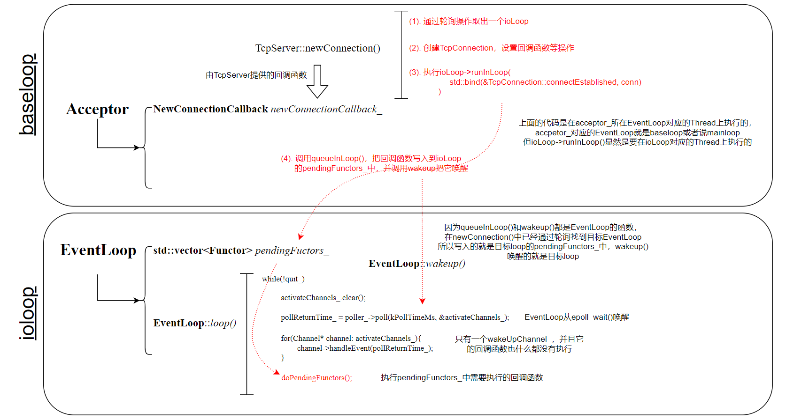

    **mainloop**交给**ioloop**让他处理的回调函数，包括把`Channel`注册到**ioloop**的`Poller`当中等操作，其中`connectionCallback_()`是用户设置的回调函数，比如可以实现连接的时候打印一些信息，fd: xxx连接到服务器等。

    ```cpp
    void TcpConnection::connectEstablished()
    {
        setState(kConnected);
        channel_->tie(shared_from_this());
        channel_->enableReading();  
        connectionCallback_(shared_from_this()); 
    }
    ```

<br>

## 2. Socket和InetAddress
`Socket`封装了文件描述符`sockfd`。在构造函数中，调用了`::socket()`创建一个套接字，并记录在`sockfd`上。把Tcp网络操作比如`::bind()`， `::listen()`都封装为成员方法。

`InetAddress`封装了ip地址和端口号以及对应处理方法，包括Tcp网络操作中的：
```cpp
memset(&addr_, 0, sizeof(addr_));
addr_.sin_family = AF_INET;
addr_.sin_addr.s_addr = inet_addr(ip.c_str());
addr_.sin_port = htons(port);
```

<br>

## 3. TcpConnection和Acceptor
`TcpConnection`的重要成员变量：
```cpp
EventLoop *loop_;
std::unique_ptr<Socket> socket_;
std::unique_ptr<Channel> channel_;
```
`Acceptor`的重要成员变量：
```cpp
EventLoop* loop_;
Socket acceptSocket_;
Channel acceptChannel_;
```
`Acceptor`是负责处理连接事件的，即**mainloop**中的活，因此他的`loop_`一定是**mainloop**。`TcpConnection`是处理已连接后的读写事件的，他的`loop_`一定不是**mainloop**，除非一共就只有**mainloop**一个`EventLoop`。

`Acceptor`在`TcpServer`构造函数中便创建。它接受了**mainloop**和服务端的ip地址端口号为参数。
`Acceptor()`中的成员变量`Channel`注册到了**mainloop**中的`Poller`，并对读事件(连接)感兴趣，设置了`Channel`处理连接事件的回调函数，其中包含了`::accept()`。当`Poller::poll()`中的`epoll_wait()`检测到`Channel`感兴趣的连接事件发生，就会调用对应的回调函数，回调函数中的`::accept()`返回了给对端创建的文件描述符用于后续处理。

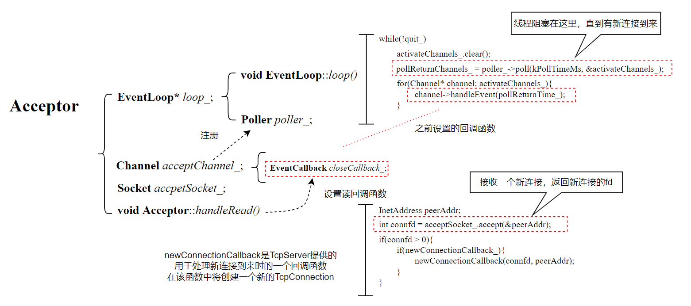

`TcpConnection`在新连接到来时，在`TcpServer::newConnection()`中创建。
`TcpConnection`的`loop_`是该函数中通过轮询从`EventLoopThreadPool`中获取的，如果`EventLoopThreadPool`没有设置初始化线程数量，那么轮询返回的就是**mainloop**，否则就是**subloop**。

其他操作和`Acceptor`类似，本质上就是分开处理不同的任务。

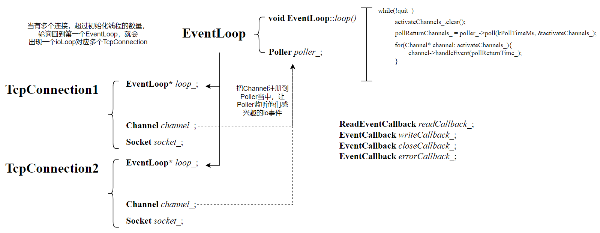


## Channel, Poller和EventLoop

简单的基于`epoll`的代码如下，涉及到`epoll`的三个主要函数`epoll_create()`, `epoll_ctl()`以及`epoll_wait()`：
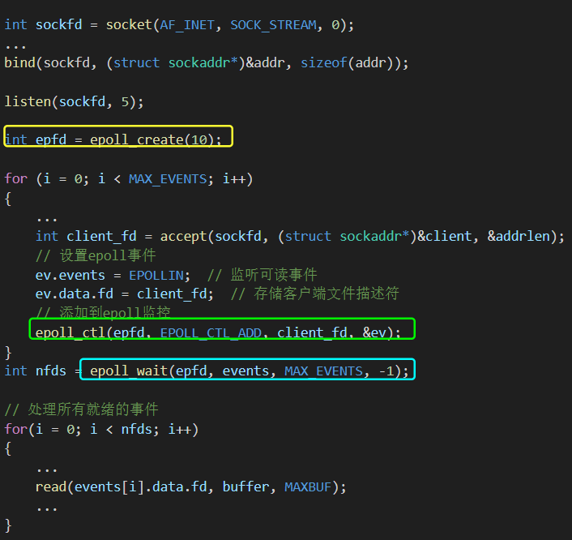

### (1) epoll_create()
这个直接就在`Poller`的构造函数中调用：
```cpp
EpollPoller::EpollPoller(EventLoop* loop):
    Poller(loop),
    epollfd_(epoll_create1(EPOLL_CLOEXEC)), 
    events_(KInitEventListSize)
{
    ...
```
### (2) epoll_ctl()
`epoll_ctl()`在`Muduo`网络库的调用方式如下，对于`Channel`可以把它类比成`struct epoll_event`，它们都封装了`fd`和`event`:
```cpp
struct epoll_event
{
  uint32_t events;  /* Epoll events */
  epoll_data_t data;    /* User data variable */
} __EPOLL_PACKED;

typedef union epoll_data
{
  void *ptr;
  int fd;
  uint32_t u32;
  uint64_t u64;
} epoll_data_t;
```
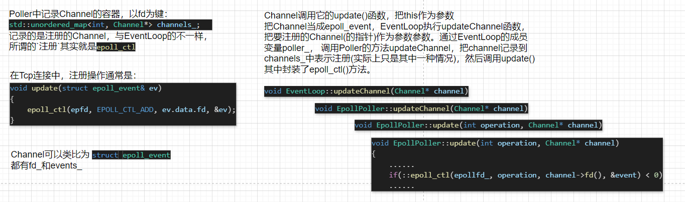
`Channel`想把自己添加到`epoll`实例，或者从实例中删除，他自己是无法做到，但是它的成员变量中记录了它所在的`EventLoop`，`EventLoop`中又记录了`Poller`指针，通过`EventLoop`再到`Poller`就可以执行到`epoll_ctl()`

### (3) epoll_wait()

在`EventLoop`和`Poller`中，都有记录`Channel`的容器，但功能上不一样，`Poller`中记录的注册即`epoll_ctl()`了的`Channel`，如果`__op`是添加，就加入到其中；而`EventLoop`的记录的是处于活跃状态的`Channel`，哪些`Channel`是活跃的`EventLoop`是事先不知道的，只有`epoll_wait()`，也就是`Poller`调用`poll()`后才知道，`EventLoop`通过`poller_`调用`poll()`时会把自己的这个`Channel`容器作为参数传入，`Poller`会把处于活跃状态的`Channel`写入到这个容器中，这样`EventLoop`就知道了。

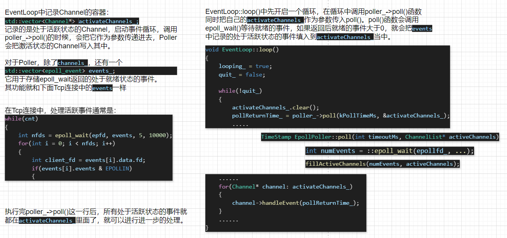

<br>

## EventLoop, Thread, EventLoopThread和EventLoopThreadPool
### (1) Thread
对`std::thread`的简单封装，记录了所在的线程号，分离了线程的创建和启动，避免了`std::thread t(threadfunc)`直接启动线程的问题。

### (2) EventLoopThread
对`Thread`的封装，除此之外的成员变量还有`EventLoop`，一个`EventLoop`对应一个`Thread`，实现了`one Loop per thread`的设计理念。`EventLoop`创建在`EventLoopThread`提供给`Thread`的线程函数中，随着线程结束被释放掉。这个线程函数本质上就是启动了一个事件循环。
```cpp
void EventLoopThread::threadFunc()
{
    EventLoop loop; 
    ...
    loop.loop();
    ...
} 
```
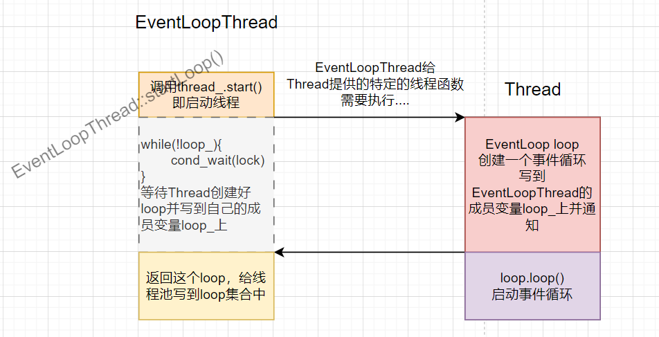

### (3) EventLoopThreadPool
`EventLoopThreadPool`中包含了一个`mainloop`和若干个`subloop`，在`Muduo`网络库中，`mainloop`用于处理连接事件，而其他的读写事件都交给`subloop`处理。`baseLoop_`通过构造函数的参数初始化，`EventLoopThread`的事件循环会创建一个`EventLoop`并返回，然后记录在`loops_`中。
```cpp
EventLoop* baseLoop_;  
std::vector<EventLoop*> loops_;
```

<br>

## 从Acceptor()看事件循环的触发调用逻辑
为`Acceptor`的成员变量`acceptChannel_`设置回调函数。
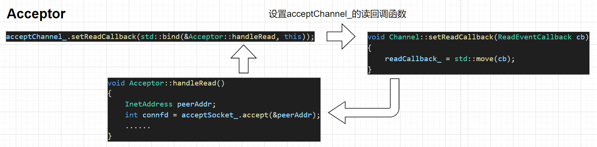
之前写的`epoll`代码，`epoll`实例都只对用户写入事件感兴趣。使`epoll`实例对用户连接事件感兴趣，只要把处理连接的套接字`server_fd_`对应的事件通过`epoll_ctl()`进行添加，这样`epoll`实例`epfd_`就会监听用户的连接事件。
```cpp
events[0].data.fd = server_fd;
events[0].events = EPOLLIN;
epoll_ctl(epfd, EPOLL_CTL_ADD, server_fd, &events[0]);
...
if(events[i].data.fd == server_fd)
{
    std::cout << "有新链接" << std::endl;
...
```
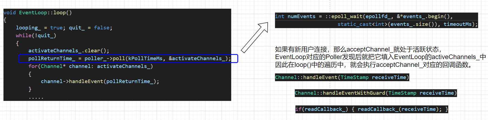

在`Acceptor`的`acceptChannel_`所属的事件循环就是`mainloop`，负责监听和处理用户的连接活动。`acceptChannel_`会被注册到`Acceptor::poller_`中，并只对用户连接事件感兴趣。`EventLoop::loop()`调用，执行`poller_->poll()`，`poll()`中执行`epoll_wait()`等待事件发生。当有新用户连接时，`epoll_wait()`就会返回，并把处于活跃状态的`Channel`写到`Eventloop`的`activeChannels_`中，`EventLoop`遍历并对调用`Channel`的回调函数。`Acceptor`的回调函数中包含了`accept()`操作，由于有新用户发起连接，因此`accept()`不会阻塞会立即回用户分配一个`fd`。


## Buffer

初始状态的下的缓冲区如图所示：


读取缓冲区可读区域的数据有两个函数：
```cpp
std::string retrieveAsString(std::size_t len);
std::string retrieveAllAsString();
```
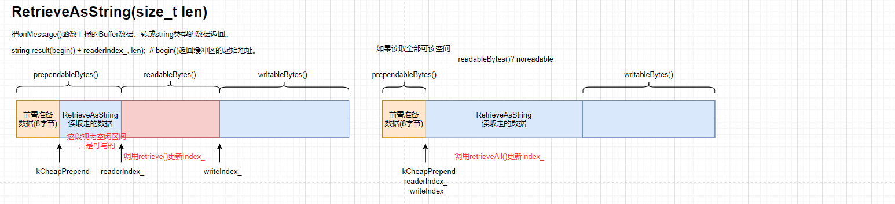

写入缓冲区可能需要扩容

缓冲区扩容，也有两种情况：如果调整缓冲区的结构可以空出一片足够长度的连续空间，就不需要扩容，如果不够再扩容
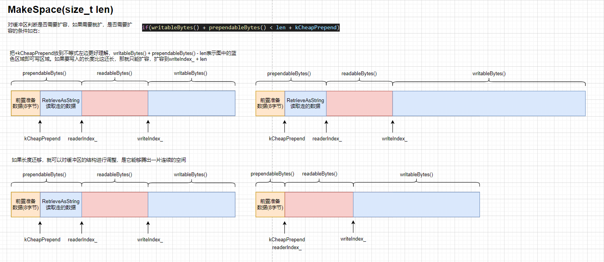
