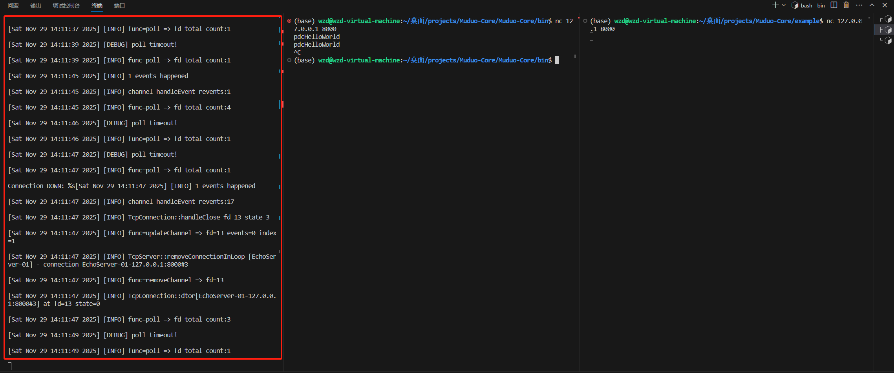
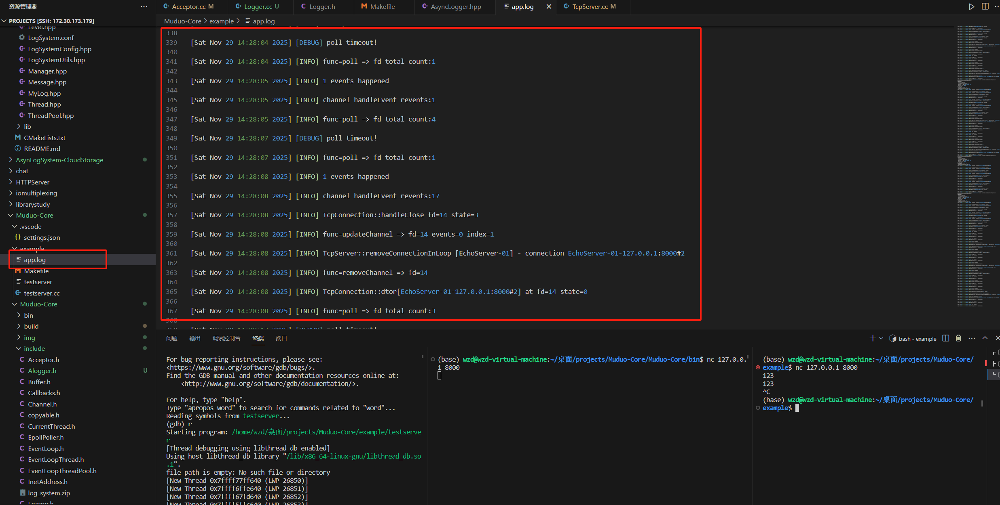
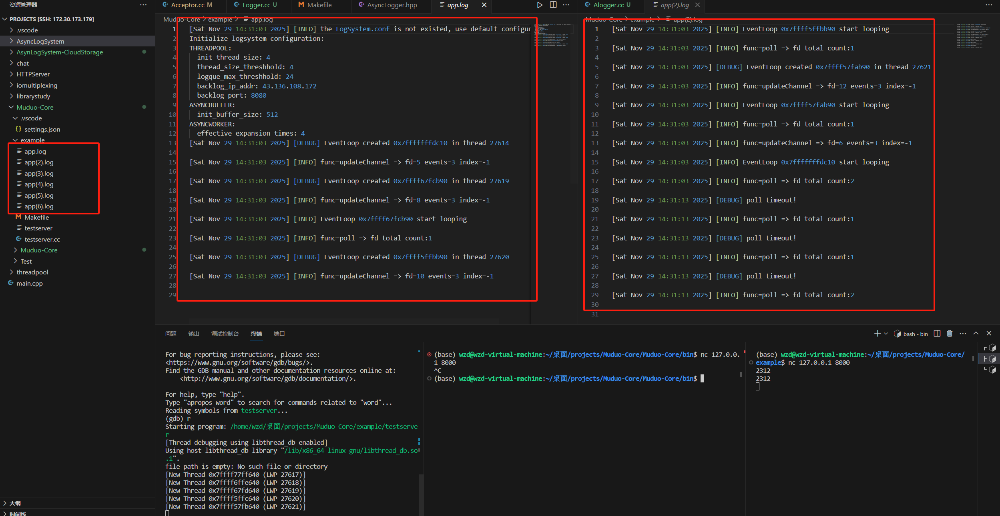

# Muduo-Core
muduo网络库的核心功能

1. 2025.10.29

    熟悉了TCP网络编程通信的一些重要方法: `socket()`, `bind()`, `listen()`, `accept()`, `send()`, `recv()`, `close()`.

2. 2025.10.31

    熟悉了epoll重要函数如`epoll_create()`, `epoll_wait()`, `epoll_ctl()`的使用，以及epoll和socket结合实现简单的服务端与客户端的通信功能。

3. 2025.11.2

    熟悉了UTP网络编程，TCP协议和UDP协议，TCP协议的三次挥手和四次挥手等

4. 2025.11.3

    熟悉了IO的同步和异步，Unix/Linux的五种IO模型，Reactor模型

5. 2025.11.4 ~ 2025.11.7

    完成了`Channel`, `Poller`, `EpollPoller`, `InetAddress`, `TimeStamp`代码的书写
    
    将异步日志系统集成到该项目中

6. 2025.11.8 ~ 2025.11.21

    完成了`EventLoop`, `Thread`, `EventLoopThread`, `EventLoopThreadPool`, `Acceptor`等代码的编写

7. 2025.11.22 ~ 2025.11.23

    完成了剩余代码的编写，实现了测试用例

8. 2025.11.29

    将异步日志系统集成到网络库中:

    解压项目中的logsystem压缩包，将其中的mylog目录拷贝到`/usr/include/`中，将其中的libmylog.so拷贝到`/usr/lib/`中

    - Console模式:
        

    - File模式:
        

    - RollFile模式:
        

 

