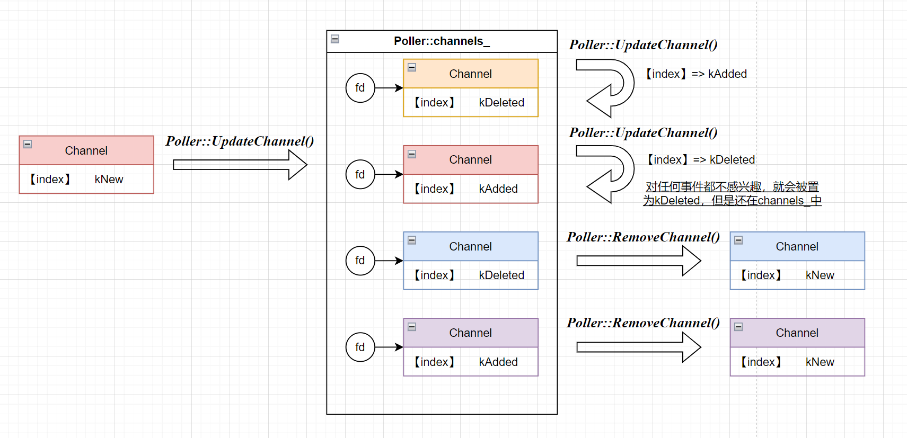

# Muduo-Core
muduo网络库的核心功能

1. 2025.10.29

    熟悉了TCP网络编程通信的一些重要方法: `socket()`, `bind()`, `listen()`, `accept()`, `send()`, `recv()`, `close()`.

2. 2025.10.31

    熟悉了epoll重要函数如`epoll_create()`, `epoll_wait()`, `epoll_ctl()`的使用，以及epoll和socket结合实现简单的服务端与客户端的通信功能。

3. 2025.11.2

    熟悉了UTP网络编程，TCP协议和UDP协议，TCP协议的三次挥手和四次挥手等

4. 2025.11.3

    熟悉了IO的同步和异步，Unix/Linux的五种IO模型，Reactor模型

5. 2025.11.4 ~ 2025.11.7

    完成了`Channel`, `Poller`, `EpollPoller`, `InetAddress`, `TimeStamp`代码的书写
    
    将异步日志系统集成到该项目中


<br>

## 从Epoll的功能看Channel,Poller以及EventLoop的关系

`epoll`有三个重要的函数，分别是`epoll_create()`, `epoll_ctl()`, `epoll_wait()`。其中`event_ctl()`负责管理`epoll`实例中的文件描述符监控列表.

### 1. Channel:
它与`epoll`封装的一个结构体`epoll_event`比较类似。
```cpp
struct epoll_event event;
event.data.fd;   // Channel的成员变量fd_;
event.events;    // Channel的成员变量events_;
```
它还包含一个额外的重要标识`index_`，表示

### 2.Poller:
它包含了两个成员变量:
```cpp
std::unordered_map<int, Channel*> channels_;  // 以Channel*对应的文件描述符`fd_`作为键。
```

```cpp
std::vector<epoll_event> events_;  // 应该在epoll_wait()的时候作为参数使用
```
两个跟`Channel*`相关的函数: `updateChannel()`和`removeChannel()`: 




